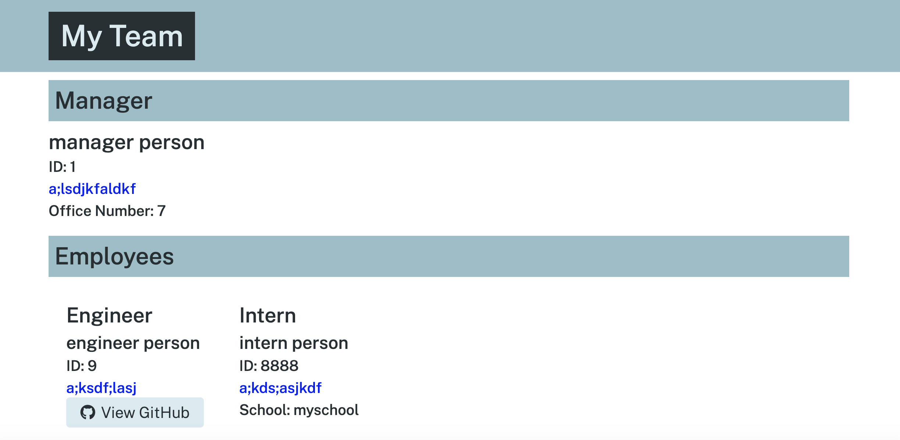

# lauramichellepeterson.github.io-challenge10

## Description
This application prompts the user for information about team members then generates an HTML index file and copies a premade CSS file.
Start the application in the console by running the command 'node index.js' at the root of the repo.
After answering the prompts, the file will be created here: ./dist/index.html
An example can be found at that location in this repo.

## Screenshot
Here is an example of the index.html file generated using this application

## Walk Through
https://drive.google.com/file/d/1VbRddYaJt_LOxBI059urGndu1jgN3QPI/view?usp=sharing

## Contact Me
https://github.com/lauramichellepeterson